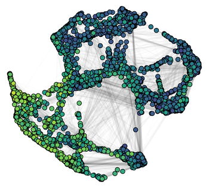

```{css, echo=FALSE}
.pagedjs_page:not(:first-of-type) {
  background: white;
}

.pagedjs_page:not(:first-of-type) {
  --sidebar-width: 0rem;
  --sidebar-background-color: #ffffff;
  --main-width: calc(var(--content-width) - var(--sidebar-width));
  --decorator-horizontal-margin: 0.2in;
}
```


```{r, include=FALSE}
knitr::opts_chunk$set(
  results='asis', 
  echo = FALSE
)

library(magrittr) # For the pipe
source("cv_printing_functions.r")

# Read in all data and initialize a CV printer object
CV <- create_CV_object(
  data_location = here::here("data/"),  
  pdf_mode = params$pdf_mode
)

```


```{r}
# When in pdf export mode the little dots are unaligned, so fix that with some conditional CSS.
if(params$pdf_mode) {
    cat("
<style>
:root{
  --decorator-outer-offset-left: -6.5px;
}
</style>")
}
```


Aside
================================================================================

```{r}
# Build interactive network of positions colored by section
# and connected if they occurred in the same year
# datadrivencv::build_network_logo(CV$entries_data)
```


```{r}
CV %>% 
  print_contact_info()
```


`r icons::fontawesome(name = "code")` Programming {#skills}
--------------------------------------------------------------------------------

```{r}
CV %>% 
  print_skill_bars(skill_type = "programming")
```

`r icons::fontawesome(name = "chart-pie")` Data analysis 
--------------------------------------------------------------------------------

```{r}
CV %>% 
  print_text_block(label = "data_analysis")
```


`r icons::fontawesome(name = "book")` Literate Coding {#skills}
--------------------------------------------------------------------------------

```{r}
CV %>% 
  print_skill_bars(skill_type = "literate")
```

Disclaimer {#disclaimer}
--------------------------------------------------------------------------------


Resume generated in R with [**pagedown**](https://github.com/rstudio/pagedown)

Source code: [github.com/keyes-timothy/cv](https://github.com/keyes-timothy/cv)

Updated `r lubridate::stamp_date("March 1, 1999")(Sys.Date())`.

`r emo::ji("pride")`


Main
================================================================================

Timothy Keyes {#title}
--------------------------------------------------------------------------------

```{r}
# Note the special double pipe so we modify the CV object in place
CV %<>% 
  print_text_block(label = "intro")
```


Education {data-icon=graduation-cap}
--------------------------------------------------------------------------------

```{r}
CV %<>% 
  print_section(section_id = "education")
```


Select Employment {data-icon=suitcase}
--------------------------------------------------------------------------------

```{r}
CV %<>% 
  print_section(section_id = "employment")
```


Select Publications {data-icon=book}
--------------------------------------------------------------------------------

```{r}
CV %<>% 
  print_section(section_id = "academic_articles")
```


Open-source software {data-icon=laptop}
--------------------------------------------------------------------------------

```{r}
CV %<>% 
  print_section(section_id = "software")
```


<!-- :::aside -->

<!-- `r icons::fontawesome(name = "trophy")` Leadership {#leadership} -->
<!-- -------------------------------------------------------------------------------- -->

<!-- **Awards** -->
<!-- - Ruth L. Kirschstein Pre-doctoral National Research Service Award (2019)  -->
<!-- - Point Foundation Graduate Student Scholarship (2020) -->
<!-- - rstudio::global(2021) Diversity Scholarship (2021) -->
<!-- - American Society of Hematology (ASH) Abstract Achievement Award (2022) -->

<!-- **Community-building** -->
<!-- - Co-founder of the Medical Student Pride Alliance (MSPA), 501(c)(3) -->
<!-- - Teaching experience: IMM 205 – “Immunology in Health and Disease,” Stanford School of Medicine (2017-2019); "R for Data Science", Stanford School of Medicine (2021) -->
<!-- ::: -->


Leadership {data-icon=trophy}
--------------------------------------------------------------------------------

```{r}
CV %<>% 
  print_section(section_id = "leadership")
```


Grants {data-icon=money-bill}
--------------------------------------------------------------------------------

```{r}
CV %<>% 
  print_section(section_id = "grants")
```


References {data-icon=envelope}
--------------------------------------------------------------------------------

```{r}
CV %<>% 
  print_section(section_id = "references")
```


{#SpiceGraphic}


